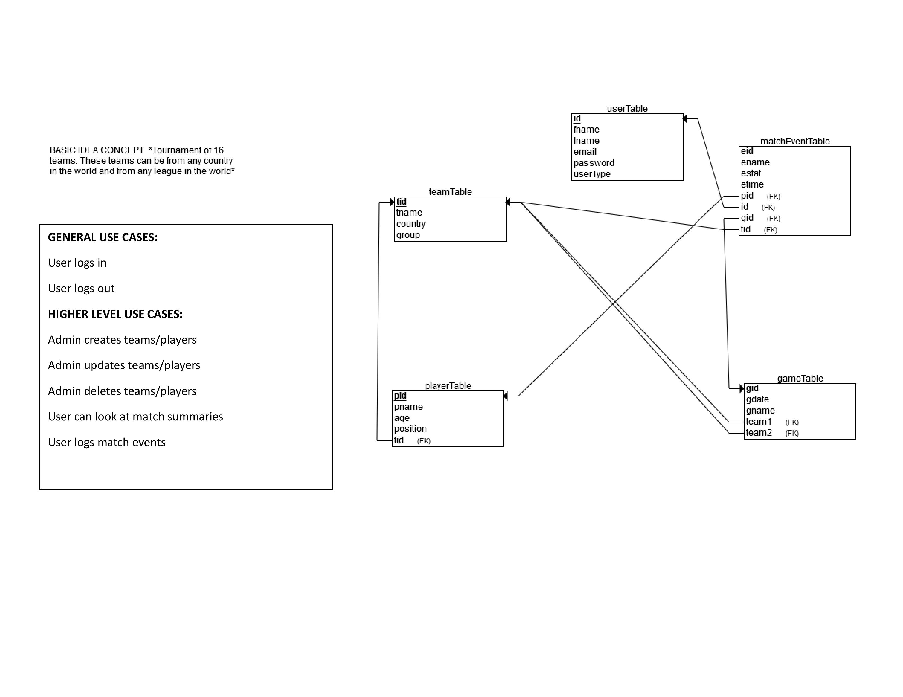

# PROJECT
Narrative:

- This app is for logging soccer match information based on a sixteen team database.
- Users can login and input soccer match events that happened during that match into a log to keep track.
- Users can edit players information and team information, along with creating new games. 
- Users can edit previous inputs into the system and can also create summaries of previous games to see.

Extras:

- Did not complete user based control Admin vs. Normal User, would have with more time. 
- Had some issues with foreign keys in some queries do to teams being separate attributes, but from the same table 

## SCHEMA AND OUTLINE

### LOGIN TABLE 

User type | Email | Password 
------------ | ------------- | --------------
Admin | v@v.com | 1234
User | r@r.com | 123

